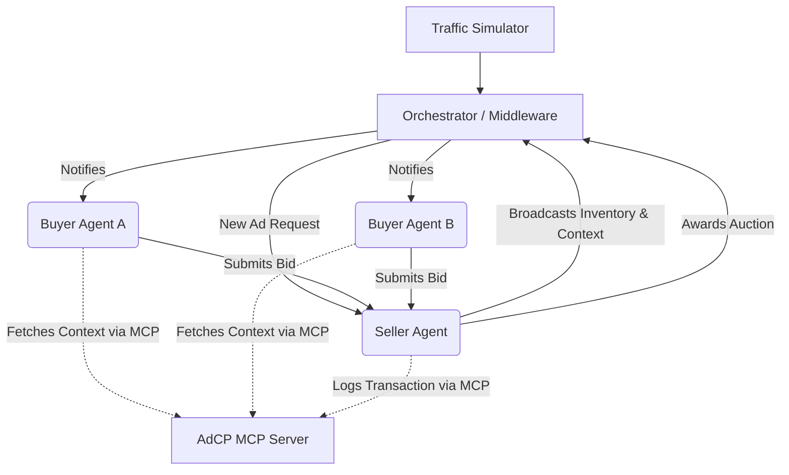

# Capstone Project: Multi-Agent Advertising Simulation (AdCP)

## 1. Project Overview
The **Advertising Context Protocol (AdCP)** is a multi-agent simulation built on top of the **Model Context Protocol (MCP)**. This project demonstrates the orchestration, collaboration, and context engineering of autonomous AI agents within a simulated digital advertising ecosystem. By modeling real-time programmatic ad bidding, the system showcases how AI agents can interact, negotiate, and make data-driven decisions autonomously.

## 2. Goals and Objectives
* **Demonstrate Multi-Agent Collaboration:** Show how independent AI agents (Buyers and Sellers) can interact, negotiate, and reach consensus in a simulated real-time bidding (RTB) environment.
* **Implement Model Context Protocol (MCP):** Utilize MCP to provide agents with a standardized, unified way to access external data (user context, page context, traffic simulation).
* **Advanced Context Engineering:** Engineer dynamic, real-time context injections so agents understand the current state of the simulation (e.g., user demographics, time of day, budget constraints).
* **Simulate Traffic & Analytics:** Create a realistic traffic generator that triggers ad requests and logs transactions to evaluate agent performance over time.

## 3. System Architecture
The architecture consists of AI agents communicating through an Orchestrator, with shared resources exposed via an MCP Server.

### Core Components
1. **MCP Server (AdCP Server):** Acts as the centralized data layer and tool provider. It exposes simulated user profiles, ad inventory, and transaction logging capabilities to the agents.
2. **Orchestrator / Middleware:** The central simulation engine that generates traffic (page views), triggers the ad exchange process, routes messages between agents, and manages the simulation clock.
3. **Seller Agent (Publisher):** Represents website owners. Its goal is to maximize yield (revenue) for its available ad slots while maintaining ad quality.
4. **Buyer Agents (Advertisers):** Represent brands. Their goal is to maximize Return on Ad Spend (ROAS) by bidding on ad slots that match their target demographics and budget constraints.

## 4. Agent Skills and Tools
The agents will be equipped with specific skills and access to MCP tools to perform their duties.

### Buyer Agent (Advertiser)
* **Objective:** Win high-quality ad slots for target demographics at the lowest possible price.
* **Skills:**
  * **Targeting Analysis:** Evaluates if a simulated user matches their campaign goals.
  * **Dynamic Bidding:** Calculates a bid price based on remaining budget, user value, and historical win rates.
* **MCP Tools (Exposed via AdCP Server):**
  * `get_campaign_budget(campaign_id)`: Checks remaining budget.
  * `get_user_demographics(user_id)`: Fetches data about the user viewing the ad.

### Seller Agent (Publisher)
* **Objective:** Maximize revenue and ensure 100% fill rate for ad inventory.
* **Skills:**
  * **Auction Management:** Evaluates incoming bids, enforces minimum floor prices, and determines the highest bidder.
  * **Yield Optimization:** Adjusts floor prices dynamically based on traffic demand.
* **MCP Tools (Exposed via AdCP Server):**
  * `get_page_context(page_id)`: Retrieves the content category and safety rating of the web page.
  * `record_transaction(ad_slot, winning_bidder, price)`: Logs the cleared transaction to the simulation database.

## 5. Middleware and Context Engineering
The **Orchestrator** serves as the middleware, coordinating the asynchronous interactions:
1. **Traffic Generation:** The middleware periodically generates a `Page View Event` (e.g., "User 452 is viewing Page 12").
2. **Context Injection (The "AdCP"):** The middleware bundles the `user_id` and `page_id` into a standard JSON context block and sends an `AdRequest` to the Seller Agent.
3. **Tool Execution:** When agents receive requests, they use their LLM reasoning capabilities to determine which MCP tools to call. For example, a Buyer Agent will see the `user_id` in the prompt, autonomously call `get_user_demographics(user_id)` via MCP, and then use that context to formulate a bid.
4. **Resolution:** The Seller agent collects all bids within a timeout window, reasons about the best offer, and executes the `record_transaction` tool via MCP.

## 6. Bootcamp Deliverables
1. **Python Codebase:** The simulation engine, agent definitions, and the custom MCP server implementation.
2. **Simulation Logs/Dashboard:** Structured output showing the real-time negotiation, context fetching, and bidding process.
3. **Presentation:** A walkthrough of the context engineering process, demonstrating how MCP allows agents to seamlessly pull in traffic and demographic data to inform autonomous decisions.
