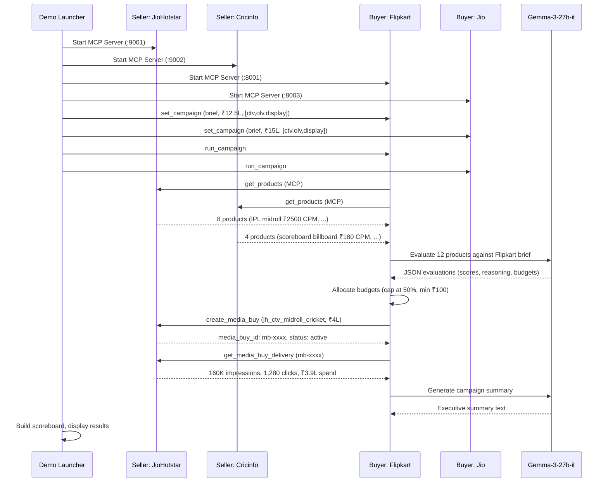

# Product Requirements Document (PRD)
# AdCP — Advertising Context Protocol Multi-Agent Simulation

**Version:** 1.0  
**Author:** Sourabh  
**Date:** 2026-05-10  
**Status:** In Progress  

---

## 1. Executive Summary

AdCP (Advertising Context Protocol) is a multi-agent simulation that models a real-world programmatic advertising ecosystem. Autonomous AI agents — representing India's top digital advertisers (Buyers) and publishers (Sellers) — discover inventory, negotiate pricing, execute media buys, and monitor delivery using the **Model Context Protocol (MCP)** as their communication backbone.

The system demonstrates how AI agents can autonomously make data-driven advertising decisions when given the right context, tools, and constraints — without human intervention in the decision loop.

---

## 2. Problem Statement

Modern programmatic advertising relies on deterministic rule engines (DSPs/SSPs) that lack the ability to reason about brand fit, audience nuance, or strategic trade-offs. This project explores a paradigm shift: **what happens when both sides of the ad exchange are intelligent agents that can read context, reason about strategy, and negotiate autonomously?**

AdCP answers this by simulating a complete buy-side and sell-side marketplace where:
- Buyer agents evaluate inventory against campaign objectives using LLM reasoning
- Seller agents serve structured inventory with rich context signals
- All communication happens over the standardized AdCP/MCP protocol

---

## 3. Goals & Success Criteria

### Primary Goals
| # | Goal | Success Metric |
|---|------|----------------|
| G1 | Demonstrate multi-agent collaboration | 5 buyer agents independently discover, evaluate, and purchase from 5 seller agents in a single simulation run |
| G2 | Implement Model Context Protocol (MCP) | All agent-to-agent communication uses JSON-RPC 2.0 over Streamable HTTP via the `adcp` SDK |
| G3 | Advanced context engineering | Buyer LLM receives structured context (audience demographics, content signals, pricing) and produces reasoned JSON evaluations |
| G4 | Simulate traffic & analytics | Delivery simulator produces realistic impressions, clicks, and spend using industry CTR benchmarks |
| G5 | Dual-sided observability | Both Advertiser and Publisher dashboards surface real-time financials, performance metrics, and AI reasoning |

### Non-Goals (Out of Scope)
- Real-time bidding (RTB) auction mechanics with sub-100ms latency
- Actual ad creative rendering or serving
- Integration with production DSP/SSP platforms
- User-facing frontend beyond CLI dashboards (web dashboards are stretch)

---

## 4. System Architecture

### 4.1 High-Level Architecture

```
┌─────────────────────────────────────────────────────────────────────┐
│                        Demo Launcher (demo.py)                      │
│         Starts all agents as subprocesses, monitors results          │
└────────────┬──────────────────────────────────────┬─────────────────┘
             │                                      │
    ┌────────▼────────┐                    ┌────────▼────────┐
    │  Campaign Manager │                    │  Campaign Manager │
    │   (manager.py)    │  × 5 buyers       │   (manager.py)    │
    │  set_campaign      │                    │  run_campaign      │
    │  run_campaign      │                    │  get_status        │
    └────────┬──────────┘                    └────────┬──────────┘
             │ JSON-RPC 2.0 / MCP                     │
    ┌────────▼──────────────────────────────────────────▼──────────┐
    │                    Buyer Agent Servers                        │
    │   :8001 Flipkart  :8002 Amazon  :8003 Jio  :8004 HUL  :8005 HDFC │
    │                                                              │
    │   Each runs: BuyerAgentHandler (ADCPHandler subclass)        │
    │   LLM: Gemma-3-27b-it via Google GenAI                      │
    │   State: BudgetManager + EventLog                            │
    └────────┬──────────────────────────────────────────┬──────────┘
             │ JSON-RPC 2.0 / MCP                       │
             │ get_products, create_media_buy,           │
             │ get_media_buy_delivery                    │
    ┌────────▼──────────────────────────────────────────▼──────────┐
    │                    Seller Agent Servers                       │
    │   :9001 JioHotstar  :9002 Cricinfo  :9003 Myntra             │
    │   :9004 NDTV        :9005 Amazon.in                          │
    │                                                              │
    │   Each runs: SellerAgentHandler (ADCPHandler subclass)       │
    │   State: MediaBuyStore (in-memory ledger)                    │
    │   Delivery: Simulated via CTR benchmarks                     │
    └──────────────────────────────────────────────────────────────┘
```

### 4.2 Component Inventory

| Component | File(s) | Role |
|-----------|---------|------|
| **Shared Models** | `models.py` | Pydantic schemas for Products, MediaBuys, Budgets, Events |
| **MCP Client** | `mcp_client.py` | JSON-RPC 2.0 HTTP client with typed error handling |
| **Agent Registry** | `registry.py` | Local simulation of AdCP Registry API (agent discovery) |
| **Buyer Agent** | `buyer/agent.py` | Core AI agent: discover → evaluate → allocate → buy → monitor |
| **Buyer Config** | `buyer/config.py` | 5 brand personas (Flipkart, Amazon, Jio, HUL, HDFC Bank) |
| **Buyer Budget** | `buyer/budget.py` | Budget allocation, spend tracking, CPM-based value computation |
| **Buyer Prompts** | `buyer/prompts.py` | System prompt, evaluation prompt, bid decision prompt, summary prompt |
| **Buyer Server** | `buyer/server.py` | MCP server with mode-multiplexed `get_products` (set/run/status/dashboard) |
| **Seller Models** | `seller/models.py` | Publisher, InventorySlot, AudienceProfile, AdFormat enums |
| **Seller Config** | `seller/config.py` | 5 publisher configs with realistic inventory, CPMs, and audience data |
| **Seller Inventory** | `seller/inventory.py` | Converts PublisherConfig → AdCP-compliant product dicts |
| **Seller Store** | `seller/store.py` | In-memory transaction ledger for media buy contracts |
| **Seller Delivery** | `seller/delivery.py` | Simulates impressions/clicks/spend using industry CTR benchmarks |
| **Seller Server** | `seller/server.py` | MCP server: get_products, create_media_buy, get_media_buy_delivery |
| **Campaign Manager** | `manager.py` | CLI tool to control a single buyer agent remotely |
| **Demo Launcher** | `demo.py` | Starts all 10 agents, runs campaigns concurrently, shows scoreboard |
| **CLI Orchestrator** | `cli.py` | Interactive/autonomous mode runner with Rich display |

---

## 5. Functional Requirements

### FR-1: Agent Discovery (Registry)

| ID | Requirement | Status |
|----|-------------|--------|
| FR-1.1 | Buyer agents discover seller agents by querying a registry | ✅ Implemented |
| FR-1.2 | Registry supports filtering by capability (`get_products`) and channel (`ctv`, `olv`, `display`) | ✅ Implemented |
| FR-1.3 | Registry mirrors the production AdCP Registry API structure (`agenticadvertising.org/api/registry/agents`) | ✅ Implemented |

### FR-2: Product Discovery (Seller → Buyer)

| ID | Requirement | Status |
|----|-------------|--------|
| FR-2.1 | Seller agents expose inventory as AdCP-compliant product dicts via `get_products` | ✅ Implemented |
| FR-2.2 | Each product includes: pricing options (CPM in INR), channels, delivery type, format IDs, publisher properties | ✅ Implemented |
| FR-2.3 | Product descriptions embed rich context signals (audience demographics, content context, brand safety tier, content signals) for LLM consumption | ✅ Implemented |
| FR-2.4 | Buyer agent aggregates products from all discovered sellers | ✅ Implemented |

### FR-3: AI-Powered Evaluation (Buyer LLM)

| ID | Requirement | Status |
|----|-------------|--------|
| FR-3.1 | Buyer agent sends discovered products + campaign brief to LLM for evaluation | ✅ Implemented |
| FR-3.2 | LLM returns structured JSON with: relevance score (0–10), reasoning, recommended budget, buy/no-buy flag | ✅ Implemented |
| FR-3.3 | Fallback heuristic scoring activates when LLM JSON parsing fails (channel overlap + price-based) | ✅ Implemented |
| FR-3.4 | System prompt is parameterized per brand (name, brief, budget, channels, strategy notes) | ✅ Implemented |
| FR-3.5 | Temperature is set to 0.3 for deterministic evaluation, 0.5 for summary generation | ✅ Implemented |

### FR-4: Budget Management

| ID | Requirement | Status |
|----|-------------|--------|
| FR-4.1 | Each buyer has a fixed campaign budget in INR | ✅ Implemented |
| FR-4.2 | Maximum single buy capped at 50% of total budget | ✅ Implemented |
| FR-4.3 | Budget allocations are reserved before execution; remaining budget is tracked in real-time | ✅ Implemented |
| FR-4.4 | Daily budget caps and impression limits are initialized (budget/30, 500K impressions) | ✅ Implemented |
| FR-4.5 | Minimum buy threshold of ₹100 enforced | ✅ Implemented |

### FR-5: Media Buy Execution

| ID | Requirement | Status |
|----|-------------|--------|
| FR-5.1 | Buyer creates media buys via `create_media_buy` MCP call | ✅ Implemented |
| FR-5.2 | Each buy includes idempotency key, brand info, packages (product_id, budget, pricing_option_id) | ✅ Implemented |
| FR-5.3 | Seller validates product exists and budget > 0 before accepting | ✅ Implemented |
| FR-5.4 | Accepted buys are stored in the seller's in-memory ledger with unique `media_buy_id` | ✅ Implemented |
| FR-5.5 | Rejected buys return status `rejected` | ✅ Implemented |

### FR-6: Delivery Simulation

| ID | Requirement | Status |
|----|-------------|--------|
| FR-6.1 | Delivery simulator calculates impressions from budget and CPM: `(budget / CPM) × 1000` | ✅ Implemented |
| FR-6.2 | Delivery efficiency factor applied (0.85–1.10 random range) | ✅ Implemented |
| FR-6.3 | CTR benchmarks used per ad format: video preroll (0.8–1.5%), midroll (0.6–1.2%), billboard (0.3–0.6%), display (0.2–0.5%) | ✅ Implemented |
| FR-6.4 | Spend capped at allocated budget | ✅ Implemented |
| FR-6.5 | Reach and frequency simulated from impressions | ✅ Implemented |

### FR-7: Observability & Reporting

| ID | Requirement | Status |
|----|-------------|--------|
| FR-7.1 | Every agent action is logged as a typed `SimulationEvent` (DISCOVER, EVALUATE, BUY, DELIVERY, ERROR) | ✅ Implemented |
| FR-7.2 | LLM token usage tracked per agent (prompt, candidates, total tokens, estimated cost in INR) | ✅ Implemented |
| FR-7.3 | AI-generated campaign summary produced at end of each run | ✅ Implemented |
| FR-7.4 | Buyer dashboard endpoint returns: financials, performance, pacing, intelligence, publisher mix, active buys, history | ✅ Implemented |
| FR-7.5 | Seller dashboard endpoint returns: revenue, content-wise breakdown, top buyers, per-product yield | ✅ Implemented |
| FR-7.6 | Competition scoreboard ranks agents by buys created and budget utilization | ✅ Implemented |

---

## 6. Buyer Agents (Demand Side)

### 6.1 Agent Personas

| Agent ID | Brand | Budget (INR) | Channels | Strategy |
|----------|-------|-------------|----------|----------|
| `flipkart` | Flipkart | ₹12,50,000 | CTV, OLV, Display | Aggressive bidder. Premium sports/entertainment. |
| `amazon_india` | Amazon India | ₹10,00,000 | CTV, OLV | Data-driven. Conservative pricing. Guaranteed deals. |
| `jio` | Jio (Reliance) | ₹15,00,000 | CTV, OLV, Display | Largest budget. Max reach & frequency. Aggressive on sports. |
| `hindustan_unilever` | Hindustan Unilever | ₹8,50,000 | CTV, OLV | Brand safety paramount. Only guaranteed premium. |
| `hdfc_bank` | HDFC Bank | ₹7,00,000 | CTV, OLV, Display | Conservative value buyer. Lowest CPM. Strict discipline. News inventory. |

### 6.2 Buyer Workflow (5-Phase Pipeline)

```
Discovery ──→ Evaluation ──→ Allocation ──→ Execution ──→ Monitoring
  (MCP)         (LLM)         (Python)       (MCP)         (MCP)
```

1. **Discovery**: Calls `get_products` on all registered seller MCP servers
2. **Evaluation**: Sends product data + brief to Gemma-3-27b-it; receives scored JSON
3. **Allocation**: Filters recommended products, caps budgets, enforces constraints
4. **Execution**: Calls `create_media_buy` on the appropriate seller
5. **Monitoring**: Calls `get_media_buy_delivery` and updates performance metrics

### 6.3 Context Engineering Strategy

| Strategy | Technique | Benefit |
|----------|-----------|---------|
| Phase-Based Decoupling | Code-orchestrated loop, not monolithic prompt | Reduces instructions held at any one time |
| Pre-LLM Filtering | Python filters products by channel match before LLM call | Reduces irrelevant token consumption |
| Structured Prompting | Mandatory JSON response schema, no conversational history | Zero conversational noise in I/O |
| State Summarization | BudgetManager + concise `ai_summary` instead of full chat history | Constant context window size |

---

## 7. Seller Agents (Supply Side)

### 7.1 Publisher Roster

| Publisher | Domain | Category | MAU | Platforms | Ad Slots | CPM Range (INR) |
|-----------|--------|----------|-----|-----------|----------|-----------------|
| JioHotstar | jiohotstar.com | Streaming | 503M | Mobile, CTV, Web | 8 | ₹60–₹2,500 |
| ESPNcricinfo | espncricinfo.com | Sports | 37M | Web | 4 | ₹90–₹220 |
| Myntra | myntra.com | Fashion | 80M | Mobile | 3 | ₹70–₹140 |
| NDTV | ndtv.com | News | 40M | Web | 4 | ₹120–₹250 |
| Amazon.in | amazon.in | E-Commerce | 150M | Web, Mobile | 8 | ₹50–₹300 |

### 7.2 Inventory Model

Each publisher is modeled as:
```
PublisherConfig
  ├── properties[]          (per-platform: Mobile App, CTV, Website)
  │     └── slots[]         (individual ad placements)
  │           ├── floor_cpm
  │           ├── ad_format  (billboard, video_preroll, video_midroll, display)
  │           ├── est_daily_impressions
  │           ├── content_context  (e.g., "live IPL cricket matches")
  │           └── brand_safety_tier  (premium / standard)
  ├── audience              (MAU, gender, age, geo, city tier distributions)
  └── content_signals       (genres, live sports, peak hours, viewer intent)
```

### 7.3 Seller MCP Tools

| Tool | Description |
|------|-------------|
| `get_adcp_capabilities` | Declares role, publisher name, supported formats, total products |
| `get_products` | Returns full inventory catalog as AdCP product dicts with publisher_properties |
| `create_media_buy` | Validates product + budget, creates contract in in-memory store |
| `get_media_buy_delivery` | Returns simulated delivery metrics (impressions, clicks, spend) |

---

## 8. Protocol & Communication

### 8.1 Transport
- **Protocol**: JSON-RPC 2.0 over HTTP
- **Transport**: MCP Streamable HTTP (`adcp` SDK v4+)
- **Auth**: Bearer token (`ADCP_AUTH_TOKEN`)

### 8.2 MCP Client Implementation
- Custom `MCPClient` class wrapping `httpx.AsyncClient`
- Supports `structuredContent` (AdCP v3 pattern) and `content[0].text` fallback
- Typed error hierarchy: `AdCPError` → `InvalidRequestError`, `RateLimitedError`, `UnauthorizedError`

### 8.3 Buyer Server Mode Multiplexing
The buyer agent server multiplexes commands through the `get_products` tool using a `mode` parameter:

| Mode | Purpose |
|------|---------|
| `set_campaign` | Configure agent with brief, budget, channels |
| `run_campaign` | Execute full 5-phase buying workflow |
| `get_status` | Return current campaign state and results |
| `get_dashboard` | Return full dashboard snapshot for Advertiser Portal |
| `discover` (default) | Forward product discovery to seller |

---

## 9. Data Models

### 9.1 Key Pydantic Models

| Model | Module | Purpose |
|-------|--------|---------|
| `BuyerPersona` | `models.py` | Brand identity, brief, budget, channels, strategy |
| `Product` | `models.py` | Seller inventory item with pricing, channels, formats |
| `ProductEvaluation` | `models.py` | LLM output: score, reasoning, budget recommendation |
| `MediaBuyRequest` / `MediaBuyResponse` | `models.py` | Buy order and confirmation |
| `DeliveryReport` | `models.py` | Impressions, clicks, spend from delivery check |
| `BuyerAgentState` | `models.py` | Budget tracking, token usage, performance metrics, daily limits |
| `SimulationEvent` | `models.py` | Typed event log entry (discover, evaluate, buy, delivery, error) |
| `PublisherConfig` | `seller/models.py` | Full publisher definition |
| `InventorySlot` | `seller/models.py` | Single ad placement with floor CPM and context |
| `AudienceProfile` | `seller/models.py` | Demographics (gender, age, geo, city tier) |
| `MediaBuyRecord` | `seller/store.py` | Seller-side contract record with delivery tracking |

### 9.2 Currency
All monetary values are in **INR (Indian Rupees)**. LLM cost estimation uses ₹83/USD conversion.

---

## 10. Tech Stack

| Layer | Technology | Version |
|-------|-----------|---------|
| Language | Python | ≥ 3.11 |
| LLM | Gemma-3-27b-it | via Google GenAI SDK (`google-genai ≥ 1.0`) |
| Protocol | AdCP SDK | `adcp ≥ 4.0` |
| HTTP Server | FastAPI + Uvicorn | `fastapi ≥ 0.111`, `uvicorn ≥ 0.29` |
| HTTP Client | httpx | `≥ 0.27` |
| Data Validation | Pydantic | `≥ 2.0` |
| CLI Display | Rich | `≥ 13.0` |
| Config | python-dotenv | `≥ 1.0` |
| Build | Hatchling | — |

---

## 11. Entry Points & CLI Commands

| Command | Script Entry | Purpose |
|---------|-------------|---------|
| `adcp-seller-server` | `seller.server:main` | Start one publisher agent (`--publisher jiohotstar --port 9001`) |
| `adcp-buyer-server` | `buyer.server:main` | Start one buyer agent (`--agent flipkart --port 8001`) |
| `adcp-manager` | `manager:cli_entry` | Control a single buyer agent (`--agent flipkart --brief "..."`) |
| `adcp-demo` | `demo:cli_entry` | Launch full 5×5 multi-agent competition |
| `python -m adcp_showcase.cli` | `cli:cli_entry` | Interactive/autonomous CLI orchestrator |

---

## 12. Simulation Flow (End-to-End)



---

## 13. Differences from Original Capstone Proposal

The original proposal (`Capstone-Project.md`) outlined a simpler architecture. Here is how the implementation evolved:

| Aspect | Original Proposal | Actual Implementation |
|--------|-------------------|----------------------|
| **Buyer Agents** | 2 generic buyers (A and B) | 5 named Indian brands with distinct personas and strategies |
| **Seller Agents** | 1 generic seller | 5 real Indian publishers with realistic inventory and audience data |
| **LLM** | Unspecified | Gemma-3-27b-it via Google GenAI with structured prompting |
| **Currency** | USD implied | INR throughout (Indian market simulation) |
| **Bidding Model** | Real-time auction with timeout | Direct media buy execution (guaranteed deals) |
| **MCP Tools** | `get_campaign_budget`, `get_user_demographics`, `get_page_context`, `record_transaction` | `get_products`, `create_media_buy`, `get_media_buy_delivery`, `get_adcp_capabilities` |
| **Agent Discovery** | Not specified | Local registry mirroring AdCP Registry API |
| **Context Engineering** | Middleware bundles context | 4-strategy noise reduction (phase decoupling, pre-LLM filtering, schema enforcement, state summarization) |
| **Orchestration** | Centralized orchestrator | Each agent is an independent MCP server; demo launcher is an observer |
| **Dashboard** | "Simulation Logs/Dashboard" | Dual-sided dashboards with financials, performance, AI intelligence, content breakdowns |
| **Communication** | Unspecified | JSON-RPC 2.0 over Streamable HTTP with typed error handling |

---

## 14. Known Gaps & Future Work

| # | Gap | Priority | Notes |
|---|-----|----------|-------|
| 1 | No web-based dashboard UI | Medium | Currently CLI-only; `get_dashboard` endpoints exist but no frontend |
| 2 | No real-time auction mechanics | Low | Current model is guaranteed direct buys, not RTB |
| 3 | Delivery simulation is stateless | Low | Each call regenerates random values; no time-series progression |
| 4 | `buyer/server.py` has an indentation bug | High | Lines 360–405 in `_handle_get_dashboard` have broken indentation |
| 5 | Duplicate `record_spend` method | Medium | `models.py` lines 220–228 define `record_spend` twice on `BuyerAgentState` |
| 6 | `cli.py` creates agents with single `mcp_client` (not list) | Medium | Constructor signature mismatch with `BuyerAgent.__init__` |
| 7 | No persistent storage | Low | All state is in-memory; lost on restart |
| 8 | No automated tests | High | No test suite exists |
| 9 | README.md is empty | High | No project documentation for external readers |

---

## 15. Environment & Configuration

### Required Environment Variables (`.env`)

| Variable | Purpose | Required |
|----------|---------|----------|
| `GEMINI_API_KEY` | Google GenAI API key for Gemma model | Yes |
| `ADCP_AUTH_TOKEN` | Bearer token for MCP agent authentication | Yes |
| `LLM_MODEL` | Override default model (default: `gemma-3-27b-it`) | No |
| `ADCP_TEST_AGENT_URL` | Override seller URL for CLI mode | No |

### Port Allocation

| Port Range | Assignment |
|------------|-----------|
| 8001–8005 | Buyer agents (Flipkart, Amazon, Jio, HUL, HDFC) |
| 9001–9005 | Seller agents (JioHotstar, Cricinfo, Myntra, NDTV, Amazon.in) |

---

## 16. Glossary

| Term | Definition |
|------|-----------|
| **AdCP** | Advertising Context Protocol — the multi-agent advertising framework |
| **MCP** | Model Context Protocol — standardized tool/resource interface for AI agents |
| **CPM** | Cost Per Mille — price per 1,000 ad impressions |
| **eCPM** | Effective CPM — actual cost calculated from spend and delivered impressions |
| **CTR** | Click-Through Rate — clicks ÷ impressions |
| **CTV** | Connected TV — ads on smart TVs and streaming devices |
| **OLV** | Online Video — video ads on web and mobile |
| **ROAS** | Return on Ad Spend |
| **DSP** | Demand-Side Platform (what buyer agents simulate) |
| **SSP** | Supply-Side Platform (what seller agents simulate) |
| **MAU** | Monthly Active Users |
| **INR** | Indian Rupees |
