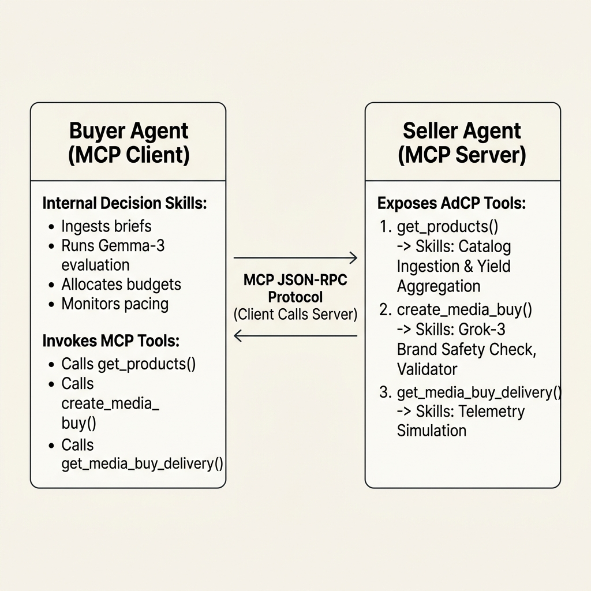
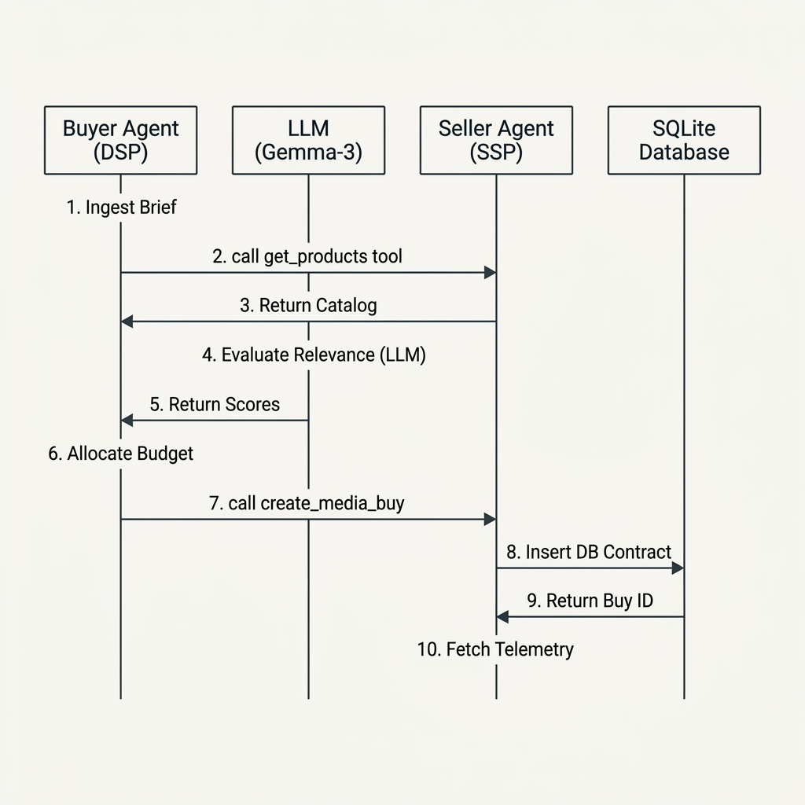

# Buyer Agent Architecture & Optimization Guide

This document outlines the structural design and context engineering strategies used for the AdCP Multi-Agent Simulation.

---

## 📑 Presentation Slides & Handshake Diagrams (Clean 2D Vectors)
*These images have been saved directly to your project root folder. You can save, download, and drop them directly into your PowerPoint / Google Slides pitch deck!*

### 1. Master System Diagram: Buyer & Seller Handshake (No Cutoffs)
*A single, high-contrast visual showing both agents, the MCP tool interface with nested skills, and SQLite ledger:*

---

### 2. Chronological Handshake Sequence Flow
*Traces the step-by-step transaction workflow from initial brief ingestion to final SQLite database contract validation:*

---

## 🛠️ MCP Client-Server Tools & Skills Mapping

In a standard AdCP environment, the communication is decoupled using the **Model Context Protocol (MCP)**:
*   **The Buyer Agent acts as the MCP Client:** It is a budget-aware orchestrator. It does not host tools itself; rather, it **invokes** them over JSON-RPC.
*   **The Seller Agent acts as the MCP Server:** Each publisher runs an independent server. It **exposes and hosts** the programmatic tools, executing custom Python and LLM skills internally upon receiving client requests.

---

### 🏢 Buyer Agent (MCP Client) — Tool Invocations & Internal Skills
*These are the internal cognitive skills of the Buyer Agent, and the corresponding external tools it calls to achieve them:*

*   **Skill: Campaign Ingestion & Discovery**
    *   *Action:* Ingests campaign briefs and looks up verified seller endpoints.
    *   *Invokes Tool:* **`get_products()`** on the target Seller Agent to fetch matching inventory catalogs.
*   **Skill: LLM Relevance Evaluation**
    *   *Action:* Passes fetched inventory data to `gemma-3-27b-it` to score placement relevance on a 0-10 scale.
    *   *Invokes Tool:* None (Internal cognitive process).
*   **Skill: Proportional Budget Allocation**
    *   *Action:* Runs local budget filters to enforce safety constraints, daily pacing limits, and a maximum 50% single-buy cap per publisher.
    *   *Invokes Tool:* None (Internal logic managed by `BudgetManager`).
*   **Skill: Contract Execution**
    *   *Action:* Transmits locked bids and secured pricing options to final transaction.
    *   *Invokes Tool:* **`create_media_buy()`** on the target Seller Agent to book campaign inventory.
*   **Skill: Performance Telemetry Monitoring**
    *   *Action:* Periodically fetches active campaign performance metrics to track average CTR, live impressions, and dynamic flight pacing.
    *   *Invokes Tool:* **`get_media_buy_delivery()`** on the target Seller Agent.

---

### 📰 Seller Agent (MCP Server) — Exposed Tools & Hosted Skills
*These are the programmatic tools hosted and exposed by the Seller Agent, and the specific Python/LLM validation skills executed under them:*

*   **Exposes Tool: `get_adcp_capabilities()`**
    *   *Nested Skill:* **Sandbox Feature Declaration** — Programmatically reports currency formats (INR), platforms, supported ad types, and active server features.
*   **Exposes Tool: `get_products()`**
    *   *Nested Skill:* **Inventory Catalog Service** — Services available ad slots, audience characteristics, and dynamic CPM floor rates.
    *   *Nested Skill:* **Dashboard Telemetry Aggregator (`get_dashboard`)** — Aggregates live financials (eCPM yield, total revenue) and ranks top programmatic buyers from the local store.
*   **Exposes Tool: `create_media_buy()`**
    *   *Nested Skill:* **Grok-3 Brand Safety Check** — Uses Grok-3-mini to assess competitive conflicts and risk scores for incoming brand domains.
    *   *Nested Skill:* **Contract & Exclusivity Validator** — Ensures package IDs are correct and that the media budget satisfies dyn-floor conditions.
    *   *Nested Skill:* **Stateful Media Contract Ledger** — Programmatically secures and persists approved campaign contracts within the publisher's secure data store.
*   **Exposes Tool: `get_media_buy_delivery()`**
    *   *Nested Skill:* **Dynamic Telemetry Simulation** — Computes and reports real-time campaign delivery stats (Impressions served, CTR %, Spend, ROAS) based on live play pacing.

---

## 1. The Buyer Agent Stack

| Component | Role | Implementation |
| :--- | :--- | :--- |
| **LLM** | Brain & Decision Maker | **Gemma-3-27b-it** (via Google GenAI) |
| **Tools (Skills)** | Interaction Layer | **MCP Client** (calls Seller `get_products`, `create_media_buy`) |
| **Knowledge** | Base Assumptions | **Persona Config** (Brand brief, strategy, INR budgets) |
| **Database** | State Persistence | **In-Memory State Machine** (BudgetManager + EventLog) |
| **Control Layer** | External Interface | **FastAPI MCP Server** (JSON-RPC 2.0) |

## 2. Context Window Engineering
To keep the agent performant and cost-effective, we use the following "Noise Reduction" strategies:

### A. Phase-Based Decoupling (Task Splitting)
*   **Logic**: The agent doesn't "run the whole campaign" in one prompt. It follows a code-orchestrated loop: `Discovery` -> `Filtering` -> `Evaluation` -> `Allocation` -> `Execution`.
*   **Code Reference**: `agent.py -> run_campaign()`
*   **Benefit**: Reduces the amount of instructions the LLM needs to hold at any one time.

### B. Pre-LLM Filtering (Context Distillation)
*   **Logic**: We use Python to filter out products that don't match the campaign's channels before sending them to the LLM.
*   **Code Reference**: `agent.py -> evaluate_products()` (Line 175)
*   **Benefit**: Drastically reduces the number of tokens consumed by irrelevant product data.

### C. Structured Prompting (Schema Enforcement)
*   **Logic**: We use a system prompt that mandates a strict JSON response. We do not use chat-style conversation history.
*   **Code Reference**: `prompts.py -> EVALUATION_SYSTEM_PROMPT`
*   **Benefit**: Zero "conversational noise" (filler words, apologies, or rambling) in the input or output.

### D. State Summarization (Signal Extraction)
*   **Logic**: Instead of a "Chat History" of every log, we maintain a `BudgetManager` object and a concise `ai_summary`.
*   **Code Reference**: `budget.py` and `agent.py -> generate_summary()`
*   **Benefit**: Keeps the context window constant rather than growing linearly with the number of transactions.

## 3. Code Map for Revisit

- **Identity & Identity**: `src/adcp_showcase/buyer/config.py`
- **Orchestration**: `src/adcp_showcase/buyer/agent.py`
- **Prompts & Logic**: `src/adcp_showcase/buyer/prompts.py`
- **Monetary State**: `src/adcp_showcase/buyer/budget.py`
- **Interface**: `src/adcp_showcase/buyer/server.py`
