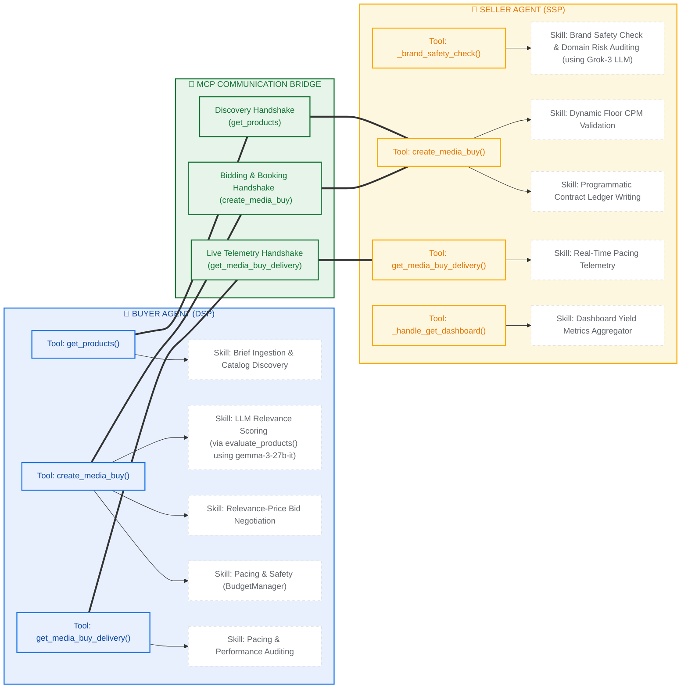

# Buyer Agent Architecture & Optimization Guide

This document outlines the structural design and context engineering strategies used for the AdCP Multi-Agent Simulation.

---

## 📑 Presentation Slides & Handshake Diagrams (Clean 2D Vectors)
*These images have been saved directly to your project root folder. You can save, download, and drop them directly into your PowerPoint / Google Slides pitch deck!*

### 1. Master System Diagram: Buyer & Seller Handshake (No Cutoffs)
*A single, high-contrast visual showing both agents and their symmetrical client-server programmatic tools with nested skills:*

---

### 2. Symmetrical Live-Rendered Vector Schematic (Interactive Diagram)
*This is a live-rendered vector schematic mapping the symmetrical client-server programmatic tools and nested cognitive skills:*

---

### 2. Chronological Handshake Sequence Flow
*Traces the step-by-step transaction workflow from initial brief ingestion to final SQLite database contract validation:*

---

---

## 🛠️ Triple-Column MCP Tools & Skills Mapping

This section outlines the exact programmatic tools and modules used by both the **Buyer Agent (DSP)** and **Seller Agent (SSP)**, with their specific execution skills nested under them:

---

### 🏢 Buyer Agent (DSP) — Tools & Nested Skills
*These are the programmatic client-side tools run by the Buyer Agent to execute its campaigns, and the internal cognitive/decisioning skills nested under each tool:*

*   **Tool: `get_products()`**
    *   **Nested Skill:** *Brief Ingestion & Catalog Discovery* — Ingests campaign briefs, registers target seller endpoints, and queries the publisher's product catalog.
*   **Tool: `create_media_buy()`**
    *   **Nested Skill:** *LLM Relevance Scoring (via `evaluate_products()`)`* — Invokes `gemma-3-27b-it` to analyze and score discovered publisher inventories on a 0-10 contextual fit scale against campaign briefs.
    *   **Nested Skill:** *Relevance-Price Bid Negotiation* — Programmatically computes customized campaign bids/budgets based on slot value vs constraints.
    *   **Nested Skill:** *Pacing & Safety Controls (`BudgetManager`)* — Enforces safety spending caps, daily pacing buffers, and a maximum 50% single-publisher spend ceiling.
    *   **Nested Skill:** *Contract Signing & Execution* — Locks bids, validates package options, and programmatically signs/submits media buy transactions.
*   **Tool: `get_media_buy_delivery()`**
    *   **Nested Skill:** *Pacing & Performance Auditing* — Periodically aggregates live campaign performance metrics to track average CTR and dynamic flight pacing.

---

### 🌁 MCP Communication Bridge
*The double-sided programmatic request/response connection channels connecting the two agents:*
*   `get_products()` ⇄ **Product Discovery Handshake**
*   `create_media_buy()` ⇄ **Relevance-Price Bidding & Contract Booking**
*   `get_media_buy_delivery()` ⇄ **Live Telemetry Auditing Handshake**

---

### 📰 Seller Agent (SSP) — Tools & Nested Skills
*These are the programmatic server-side tools and helper methods executed by the Seller Agent, and the specific publisher skills nested under each tool:*

*   **Tool: `_brand_safety_check()`**
    *   **Nested Skill:** *Brand Safety Check & Domain Risk Auditing* — Uses Grok-3 LLM to zero-shot audit domain reputation, brand category fit, and competitive conflicts.
*   **Tool: `create_media_buy()`**
    *   **Nested Skill:** *Dynamic Floor CPM Validation* — Matches incoming proposed budgets against dynamic floor CPM requirements.
    *   **Nested Skill:** *Programmatic Contract Ledger Writing* — Persists stateful media contracts securely to private publisher storage.
*   **Tool: `get_media_buy_delivery()`**
    *   **Nested Skill:** *Real-Time Pacing Telemetry* — Computes play-by-play impressions and click schedules based on active flight pacing.
*   **Tool: `_handle_get_dashboard()`**
    *   **Nested Skill:** *Dashboard Yield Metrics Aggregator* — Summarizes aggregate publisher revenue, dynamic eCPM, and top buyer metrics.

---

## 1. The Buyer Agent Stack

| Component | Role | Implementation |
| :--- | :--- | :--- |
| **LLM** | Brain & Decision Maker | **Gemma-3-27b-it** (via Google GenAI) |
| **Tools (Skills)** | Interaction Layer | **MCP Client** (calls Seller `get_products`, `create_media_buy`) |
| **Knowledge** | Base Assumptions | **Persona Config** (Brand brief, strategy, INR budgets) |
| **Database** | State Persistence | **In-Memory State Machine** (BudgetManager + EventLog) |
| **Control Layer** | External Interface | **FastAPI MCP Server** (JSON-RPC 2.0) |

## 2. Context Window Engineering
To keep the agent performant and cost-effective, we use the following "Noise Reduction" strategies:

### A. Phase-Based Decoupling (Task Splitting)
*   **Logic**: The agent doesn't "run the whole campaign" in one prompt. It follows a code-orchestrated loop: `Discovery` -> `Filtering` -> `Evaluation` -> `Allocation` -> `Execution`.
*   **Code Reference**: `agent.py -> run_campaign()`
*   **Benefit**: Reduces the amount of instructions the LLM needs to hold at any one time.

### B. Pre-LLM Filtering (Context Distillation)
*   **Logic**: We use Python to filter out products that don't match the campaign's channels before sending them to the LLM.
*   **Code Reference**: `agent.py -> evaluate_products()` (Line 175)
*   **Benefit**: Drastically reduces the number of tokens consumed by irrelevant product data.

### C. Structured Prompting (Schema Enforcement)
*   **Logic**: We use a system prompt that mandates a strict JSON response. We do not use chat-style conversation history.
*   **Code Reference**: `prompts.py -> EVALUATION_SYSTEM_PROMPT`
*   **Benefit**: Zero "conversational noise" (filler words, apologies, or rambling) in the input or output.

### D. State Summarization (Signal Extraction)
*   **Logic**: Instead of a "Chat History" of every log, we maintain a `BudgetManager` object and a concise `ai_summary`.
*   **Code Reference**: `budget.py` and `agent.py -> generate_summary()`
*   **Benefit**: Keeps the context window constant rather than growing linearly with the number of transactions.

## 3. Code Map for Revisit

- **Identity & Identity**: `src/adcp_showcase/buyer/config.py`
- **Orchestration**: `src/adcp_showcase/buyer/agent.py`
- **Prompts & Logic**: `src/adcp_showcase/buyer/prompts.py`
- **Monetary State**: `src/adcp_showcase/buyer/budget.py`
- **Interface**: `src/adcp_showcase/buyer/server.py`
